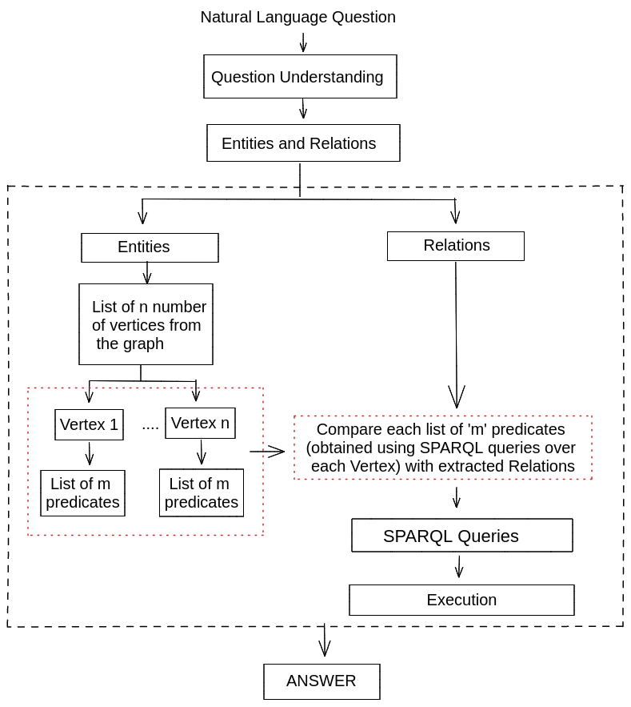

# Question Answering 
### Parallelizing Entity and Relation linking using Spark

Question Answering in general has three phases:
1. Question Understanding 
2. Entity and Relation Linking 
3. Filtering

Challenges:
1. Memory constraints
2. Time constraints

Solution:
1. Parallelize the task of linking where multiple small independent tasks are taking place. 
2. We can use SPARK transformations, and SPARK thread pools. 
